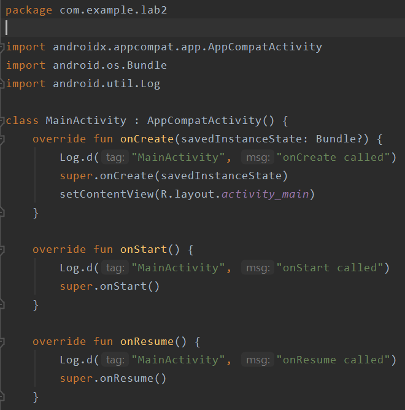
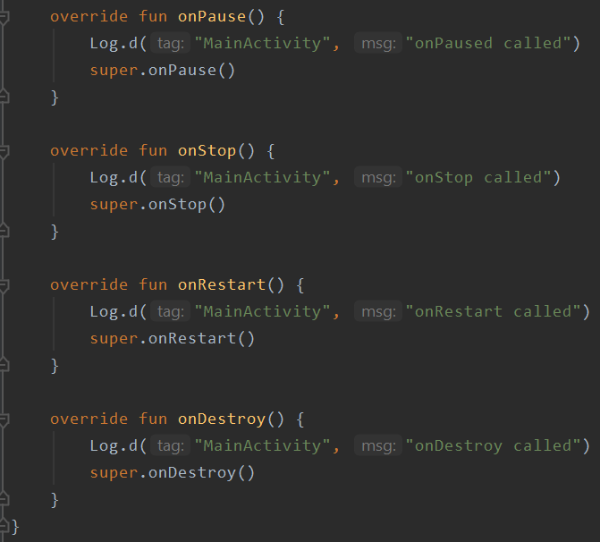
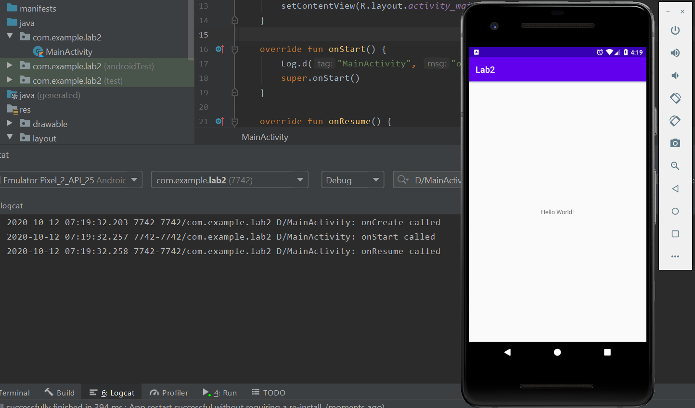
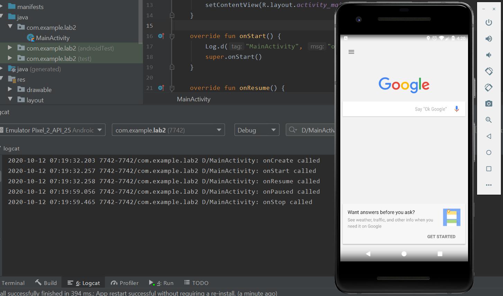
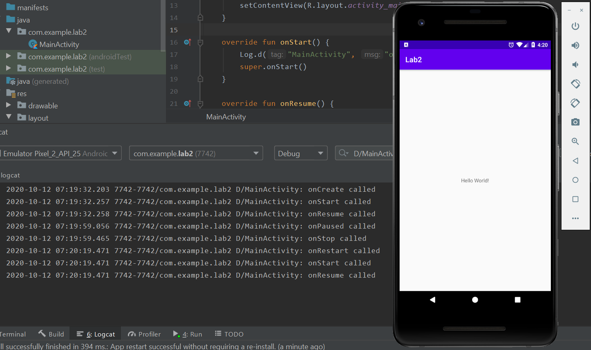
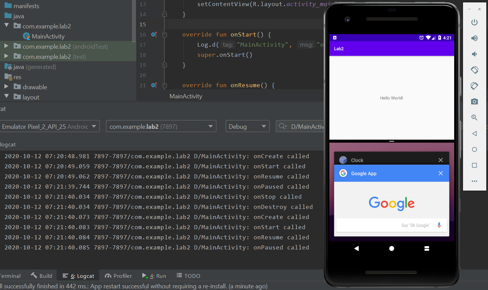
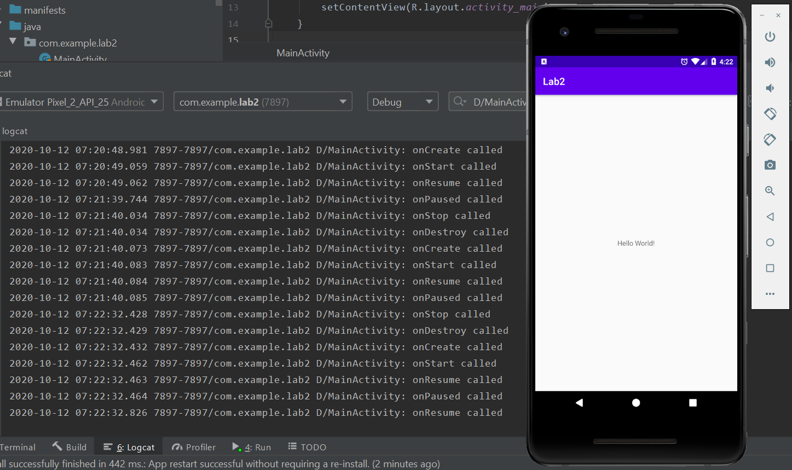
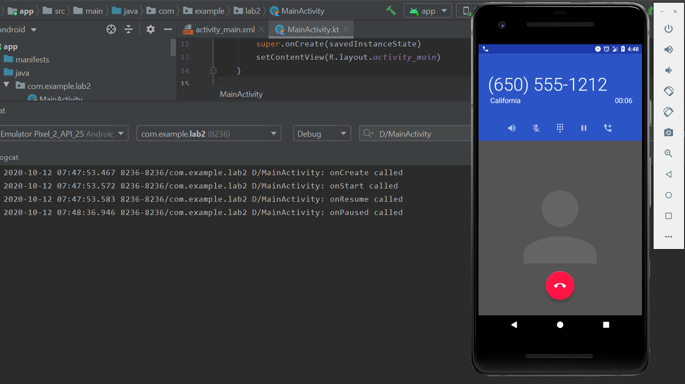

# Лабораторная работа №2. Activity Lifecycle. Alternative resources.
## Цели
  - Ознакомиться с жизненным циклом Activity
  - Изучить основные возможности и свойства alternative resources
## Программа работы
#### Задача 1. Activity
В рамках данного задания было создано простое приложение с 1 текстовым блоком, переопределены методы состояний приложения для вывода сообщений в журнал логов и рассмотренно 3 нетривиальных ситуации.

*Рис. 1.1.  Код файла MainActivity.kt*




##### 1) Открытие Google
После запуска приложения (Рис. 1.2) в журнале логов, как и ожидалось, появились сообщения о том, что вызваны методы onCreate, onStart и onResume (Приложение было запущено, выведено на экран и стало доступно для взаимодействия). *В последующих двух пунктах этот момент будет повторяться, поэтому в отчет не войдет.*

*Рис. 1.2 Запуск приложения*


Далее, зажатием кнопки "Домой" был открыт сервис Google (Рис. 1.3). На рисунке можно увидеть, что были вызваны методы onPause и onStop. Это связано с тем, что новое приложение заняло весь экран, а значит наше больше не отображается, но всё еще запущено (метод onDestroy не вызывался).

*Рис. 1.3 Запуск Google*


После этого окно приложение было снова открыто (Рис. 1.4) и, как видно из журнала, вызван метод повторного запуска onRestart и методы onStart и onResume.

*Рис. 1.4 Возвращение в начальное приложение*


##### 1) Запуск многооконного режима
Во время работы приложения, зажатием кнопки "Меню", был запущен многооконный режим (Рис. 1.5). В журнале можно наблюдать последовательность сообщений, говорящих о том, что при переходе в новый режим процесс был уничтожен, а потом заново запущен, после чего перешел в режим ожидания, а возможность взаимодействовать была передана другому приложению.

*Рис. 1.5 Запуск многооконного режима*



Далее повторным зажатием кнопки "Меню" многооконный режим был отключен (Рис. 1.6), а в журнале появилась еще одна последовательность сообщений, говорящая о том, что приложение снова было полностью закрыто и заново запущено, причем в конце оно снова было поставлено в режим ожидания и сразу возвращено в рабочий.

*Рис. 1.6 Выход из многооконного режима*



##### 2) Ответ на входящий звонок
Во время работы приложения на эмуляторе был принят входящий звонок (Рис. 1.7). В журнале можно наблюдать сообщения о том, что приложение было остановлено, так как режим разговора занял весь экран, но не закрыто полностью.

*Рис. 1.7 Ответ на входящий звонок*


После завершения звонка (Рис. 1.8) были вызваны методы onRestart, onStart и onResume и приложение вернулось в исходное состояние.

*Рис. 1.8 Завершение звонка*


___

#### Задача 2. Alternative Resources
**Primary text method** — квалификатор конфигурации, отвечающий за наличие у устройства физической клавиатуры. Имеет 3 возможных значения: nokeys (нет внешней клавиатуры), qwerty(наиболее распространенная сейчас клавиатура), 12key (клавишии от 0 до 9, * и #).

**Пример использования в приложении:** разный тип управления в игре в зависимости от типа клавиатуры и соответственно разные подсказки вида: 
Для передвижения и стрельбы используйте:
   - (nokeys) Джостик и кнопку выстрела на экране
   - (qwerty) Клавиши W, A, S, D и G
   - (12key) Клавиши 2, 4, 6, 8 и 5

___

#### Задача 3. Best-matching resource
Задание (Вариант 12):
Конфигурация устройства:

```
LOCALE_LANG: en
LOCALE_REGION: rUS
SCREEN_SIZE: xlarge
SCREEN_ASPECT: notlong
ROUND_SCREEN: round
ORIENTATION: land
UI_MODE: car
NIGHT_MODE: notnight
PIXEL_DENSITY: tvdpi
TOUCH: finger
PRIMARY_INPUT: nokeys
NAV_KEYS: wheel
PLATFORM_VER: v27

Конфигурация ресурсов:
(default)
rCA-xxhdpi-trackball
xhdpi
fr-notlong-land-v26
en-long-land-finger-v25
xlarge-notlong-notround-vrheadset-dpad-v25
en-xxxhdpi-qwerty
normal-watch-notnight
notround-night-nokeys
en-rFR-xlarge-notlong-round-port-watch-mdpi-v27
rCA
```

1) На первом шаге отсекаются все конфигурации, противоречащие конфигурации устройства: 
 
 ```
(default)
```

Остается только конфигурация по умолчанию (default).
___

#### Задача 4. Сохранение состояние Activity
Выявленные в работе исходного приложения ошибки: секундомер продолжает считать, если приложение не отображается на экране, счетчик сбрасывается при кратковременных закрытиях приложения (при повороте экрана или переходе в многооконный режим). Дополнительно: Текст на экране не имеет привязок (констрейнтов). 
**Решение:** для остановки секундомера была лобавлена переменная, принимающая значение true в методе onStart и false в методе onStop и разрешающая счет. Таким образом, когда приложение не отображается, секундомер останавливается. Для сохранения значения секундомера были переопределены методы onSaveInstanceState (записано значение сетчика при остановке приложения) и onRestoreInstanceState (при перезапуске из onSaveInstanceState считано значение при повторном запуске (onCreate) приложения). После внесения всех изменений приложение стало работать корректно, секундомер не сбрасывается при повороте экрана и останавливается, если приложение не отображается.

*Код программы*
```
package com.example.lab2

import android.os.Bundle
import android.util.Log
import androidx.appcompat.app.AppCompatActivity
import kotlinx.android.synthetic.main.fourth_task.*

const val WATCH_STATE = "watch_state"

class MainActivity : AppCompatActivity() {
    private var secondsElapsed: Int = 0
    private var onScreen = true
    private val TAG = "MainActivity"

    private var backgroundThread = Thread {
        while (true) {
            Thread.sleep(1000)
            if (onScreen) {
                textSecondsElapsed.post {
                    textSecondsElapsed.text = "Seconds elapsed: " + secondsElapsed++
                }
            }
        }
    }

    override fun onCreate(savedInstanceState: Bundle?) {
        Log.d(TAG, "onCreate called")
        super.onCreate(savedInstanceState)
        setContentView(R.layout.fourth_task)
        backgroundThread.start()
        
        if (savedInstanceState != null) {
            secondsElapsed = savedInstanceState.getInt(WATCH_STATE, 0)
        }
    }

    override fun onStart() {
        Log.d(TAG, "onStart called")
        onScreen = true
        super.onStart()
    }

    override fun onResume() {
        Log.d(TAG, "onResume called")
        super.onResume()
    }

    override fun onPause() {
        Log.d(TAG, "onPaused called")
        super.onPause()
    }

    override fun onStop() {
        Log.d(TAG, "onStop called")
        onScreen = false
        super.onStop()
    }

    override fun onRestart() {
        Log.d(TAG, "onRestart called")
        super.onRestart()
    }

    override fun onDestroy() {
        Log.d(TAG, "onDestroy called")
        super.onDestroy()
    }

    override fun onSaveInstanceState(outState: Bundle) {
        super.onSaveInstanceState(outState)
        outState.putInt(WATCH_STATE, secondsElapsed)
        Log.d(TAG, "onSaveInstanceState called")
    }
}
```

___

## Вывод
В ходе выполнения лабораторной работы было проведено ознакомление с жизненным циклом Activity и изучены альтернативные ресурсы. На каждую из 2 тем выполнено по 2 задания:
   - Открытие сервисов Google, ответ на звонок и переход в многооконный режим позволили наблюдать нетривиальные переход между состояниями приложения; 
   - Найдено применение квалификатору Primary text method; 
   - Изучен выбор Android'ом наиболее подходящих конфигураций; 
   - При поиске ошибок в continuewatch рассмотрены методы сохранения и восстановления состояний, позволившие избежать потерь данных; 
